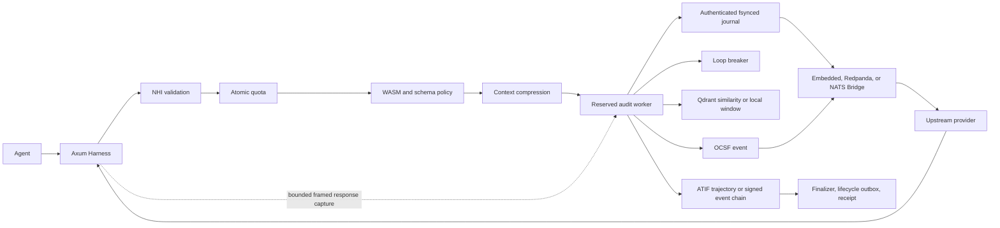

# Architecture

## Request flow

Production routes reserve bounded worker capacity before mutating quotas. Chat and MCP effects wait until their request or authorization event is journaled and published; synchronous quota, WASM, and compression work runs on Tokio's blocking pool. Provider responses have a pre-reserved capture slot. Non-SSE responses are bounded and validated before delivery; SSE uses a bounded byte-oriented decoder.

Receipt signing and ATIF serialization remain off the request path. Worker overload fails before quota mutation and is counted in `av_events_dropped_total`.

## Crates

- `av-core`: identifiers, time, token estimates, digests, metrics.
- `av-events`: OCSF agent event model and validation.
- `av-atif`: ATIF v1.0-v1.7 reader, strict v1.7 writer, atomic persistence.
- `av-receipts`: RFC 8785 canonicalization, hash chains, Ed25519 receipts.
- `av-state`: atomic counters and multi-dimensional budgets, memory and Redis.
- `av-bridge`: EventBus, embedded log, Kafka/Redpanda, NATS JetStream.
- `av-identity`: EdDSA/HS256 NHI validation, delegation, JWKS refresh.
- `av-compress`: auditable, idempotent context reduction.
- `av-loopdetect`: hash or ONNX embeddings, circuit breaker, Qdrant sink.
- `av-sandbox`: JSON-RPC parsing, JSON Schema, native and WASM policy.
- `av-harness`: proxy, routes, workers, sessions, reconciliation.
- `av-cli`: operational commands and load generation.

## Session lifecycle

A session is opened on first use and assigned `signed` or `unsigned` once. Close first blocks new work, drains accepted worker jobs, then:

- Signed: verifies the authenticated event journal, snapshots the event-chain head, and signs one receipt in `spawn_blocking`.
- Unsigned: snapshots, validates, atomically writes, and parent-fsyncs ATIF v1.7 without consuming retry state.
- Promotion: validates persisted ATIF, hashes it, and signs one idempotent retroactive receipt.
- Receipt and close events use deterministic fsynced outboxes with persisted broker acknowledgments.

Tool forwarding holds a session lease through bounded response capture and completion auditing. JSON-RPC ids back durable execution claims; uncertain crash outcomes are never re-executed automatically. Shutdown bounds HTTP drain, worker drain, and OTLP flush independently.

## Portability

The manifest declares topics, partitions, retention, cold storage, and JSON Schema references. Embedded provisioning copies and compiles referenced schemas. Kafka verifies partitions and `retention.ms`; NATS configures stream age. Secured endpoints are environment-driven: `AV_KAFKA_CA_FILE` plus `AV_KAFKA_SASL_USERNAME`/`AV_KAFKA_SASL_PASSWORD` (mechanism from `AV_KAFKA_SASL_MECHANISM`: `SCRAM-SHA-256` default, `SCRAM-SHA-512`, or `PLAIN`; credentials are refused without TLS) for Kafka/Redpanda, `AV_NATS_CA_FILE` plus `AV_NATS_USER`/`AV_NATS_PASSWORD` for NATS. Cold writes use deterministic object keys plus a local durable retry outbox (`AV_COLD_OUTBOX_DIR` overrides its location; network backends default to the CWD-relative `data/cold-outbox`, the embedded broker to `<bridge_data_dir>/cold-outbox`), independently of broker acknowledgment; `s3://` targets (feature `cold-store-aws`) take standard `AWS_*` credentials.
